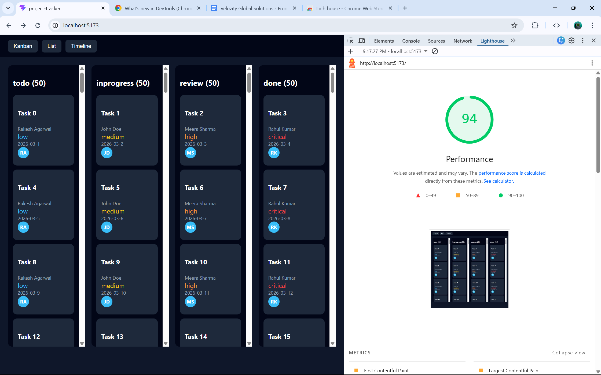

# Project Tracker UI

## Overview
A multi-view project management tool with Kanban, List, and Timeline views using a shared dataset.

## Features
- Kanban board with custom drag-and-drop
- List view with sorting and virtual scrolling
- Timeline (Gantt) view with date-based positioning
- URL-based view switching
- Avatar-based collaboration indicators

## Tech Stack
- React + TypeScript
- Zustand for state management
- Custom CSS (no UI libraries)

## Setup
npm install  
npm run dev  

## State Management
Zustand was chosen for its simplicity and minimal boilerplate. It allows a global store that keeps all views in sync without prop drilling.

## Virtual Scrolling
Implemented manually using fixed row height and calculating visible items based on scroll position. This reduces DOM nodes and improves performance.

## Drag and Drop
Built using native HTML5 drag events. Task IDs are passed through dataTransfer, and state updates are handled centrally.

## Lighthouse Score

## Live Demo
https://project-tracker-black-six.vercel.app/